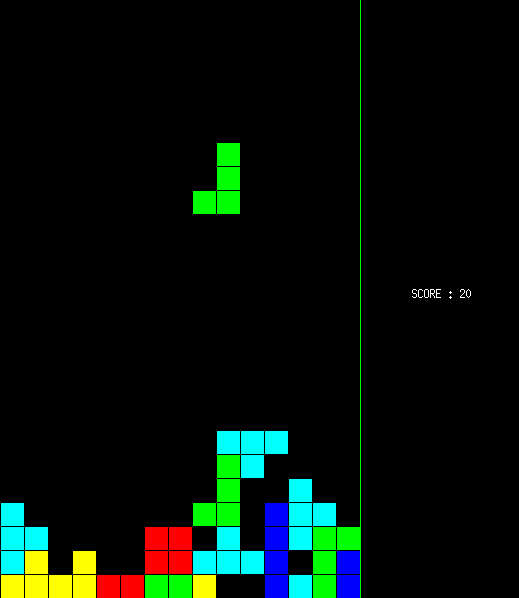

# tetris
Juego Tetris C++ (Hago uso de la librería miniwin creada por Pau Fernandez (Barcelona) )

El juego sólo está disponible para Linux actualmente. Descargar el .zip y descomprimir con $unzip tetris.zip ó $unzip tetris-master.zip, según se descargue; 
Después acceder a la carpeta descomprimida "tetris" con $cd tetris, y ejecutar $chmod +x compila, para dar permisos de ejecución al archivo compila, que compilará el código (podríamos haberlo hecho con un makefile pero resultaba más cómodo así). Posteriormente ejecutar $./compila, y posteriormente $./tetris para jugar. 

El juego se ha desarrollado haciendo uso de la librería "miniwin" creada por Pau Fernández. Url a la documentación: http://miniwin.readthedocs.io/en/latest/ . Este juego se ha creado sin fines comerciales. Su único fin es educativo para el manejo de clases y objetos con C++, así como la gestión de dependencias y archivos .h y su posterior compilación con un archivo makefile. 

Proyecto de la asignatura Metodología de la Programación (UGR)

